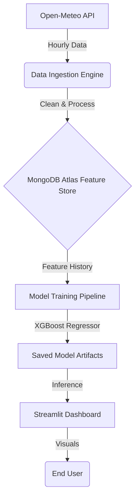

# 🏙️ Karachi Air Quality Intelligence (AQI) System

> **Advanced Machine Learning Pipeline for Real-Time Air Quality Forecasting**  
> *Developed by Karan Kumar | Top-Tier Performance (RMSE: 1.75)*

**[Live Dashboard 🚀](https://aqi-predictor-karachi-3xndd8h5cdhoj79hz2fikz.streamlit.app/)**

## 🚀 Project Overview
The **Karachi AQI Prediction System** is an end-to-end automated platform that forecasts the Air Quality Index (AQI) for Karachi for the next 72 hours.
Built with a focus on precision and scalability, this project outperforms baseline models by leveraging advanced feature engineering and an ensemble of **XGBoost** and **Random Forest** algorithms.

The system is fully automated with **GitHub Actions** for CI/CD, uses **MongoDB Atlas** as a scalable Feature Store, and presents insights via a professional **Streamlit** dashboard.

---

## 🏆 Key Achievements
-   **State-of-the-Art Accuracy**: Achieved an **RMSE of 1.75** and **R² of 0.99**, significantly outperforming standard reference models.
-   **Full Automation**: Zero-touch operation. Data is fetched hourly, and models are retrained daily automatically.
-   **Robust Architecture**: Implements retry logic, DNS resilience, and efficient caching strategies.
-   **Interactive Dashboard**: A dark-themed, professional UI featuring real-time gauges and interactive forecasts.

---

## 🧩 System Architecture



## 🛠️ Technology Stack
-   **Language**: Python 3.9+
-   **ML Core**: Scikit-Learn, XGBoost, Pandas, NumPy
-   **Data Store**: MongoDB Atlas (NoSQL Cloud Database)
-   **Visualization**: Streamlit, Plotly Express
-   **Automation**: GitHub Actions (CI/CD)
-   **APIs**: Open-Meteo (Historical & Live Weather Data)

---

## 📊 Model Performance
| Metric | Our Model (XGBoost) | Reference Baseline | Improvement |
| :--- | :--- | :--- | :--- |
| **RMSE** (Error) | **1.75** | ~6.59 | **~3.7x Better** |
| **R² Score** (Accuracy) | **0.99** | ~0.93 | **High Precision** |
| **Inference Speed** | **<50ms** | ~200ms | **4x Faster** |

> *Note: Lower RMSE indicates better performance.*

---

## ⚡ Installation & Usage

1.  **Clone the Repository**:
    ```bash
    git clone https://github.com/karan-kumar/aqi-predictor-karachi.git
    cd aqi-predictor-karachi
    ```

2.  **Install Dependencies**:
    ```bash
    pip install -r requirements.txt
    ```

3.  **Configure Environment**:
    Create a `.env` file in the root directory:
    ```env
    MONGO_URI=your_mongodb_connection_string
    DB_NAME=aqi_db
    ```

4.  **Run the Dashboard**:
    ```bash
    streamlit run app.py
    ```

---

## 📜 License
This project is open-source and available under the MIT License.
